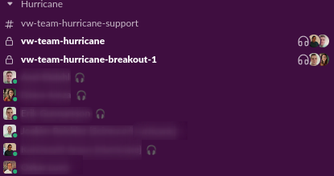
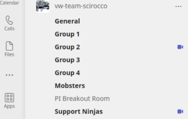

---
layout: post
title: "The remote mob programming cookbook"
author: Kaj Fehlhaber
date: 2022-06-17
--- 

Was your Corona remote work period a lonely experience with a lot of Slack messages and PR:s to reivew? Well, it doesn't need to be that bad, but let me share some experiences with working with remote mob proramming as default.
And before you say "That seems awfully inefficient, one programming and others watching!"; keep on reading! Let me share how I have been working in my two previous teams!

# The remote team cookbook
The main identifiers for a successful remote team in my experience has been those hat can mimic the communication bandwidth of being co-located combined with the focus of being remote. 

A high trust environment is crucial and the described approach will help in achieving it, but at the same time requires that proper attention is put in having a good environment.

_Let's go through the ingredients one by one!_
- Ensembles by default
- Find the right size
- Open sessions for every groups
- Active knowledge sharing
- Explore what works for the team
- Effective ensembles
- Quick rotations/handovers
- High quality sound & video

## Ensembles by default
The first and biggest step is for the team to switch from doing pairs ad-hoc once in a while to do it by default! Pair and ensemble programming becomes the defacto standard within the team and going solo is the exception during the main work day.

There are still lot of things that we need to do on our own and we need different amount of time for solo work in the team. This can be things like reading up on something, time reporting, etc. The important part when going to ensemble by default is to _set some ground rules_. 

In my teams we've usually started our ensembles after having a daily and having solo work before that (optionally starting up a session to invite others to join).
Lunch is at a set time with a semi-fluent length and working in the ensemble until we decide to break it up to finish of for the day or to handle some business on our own.

This has worked quite well for us since we've built up a high trust environment - often experiment and reflecting in order to change when needed. My recommendation would be to start with this kind of simple setup first and then alter if needed.

## Find the right size
Ensemble/mob programming can be efficiently implemented in teams of varying sizes, but still adhere to the same restrictions as any other team i.e. best 8 or less. I have been using this method successfully in a team of 8, but also in a growing team from 2 to 5.

The way the method scales is in the ability to break out in multiple ensembles or pairs and swarm quickly and frequently. Experiment with what sizes fit best for your team, but the sizing that has worked best in my experience is to have groups of 2-3 people and rather have 2 groups with 3, rather than 3 groups with 2. 

This splitting also works very good when you own a service which you need to support. One group can handle support, look into bug reports, do improvement work and so forth, while the others focus on feature development.

When you start splitting you start to loose on knowledge sharing and you don't want to create silos. To counteract this, some mechanism needs to be in place so that there is a natural rotation between the groups. This can be triggered by a support schedule, or you simply roll the dice at the beginning of the week or what not. The rotation should be often enough to make it a natural part of work and not so often that it causes context switching.

## Open session for every group
A key element of remote ensembles and especially with multiple groups is to have the means to seamlessly join, switch and leave groups. It should be as easy as when you're sitting in the office together - just move over.

I've been using Teams and Slack which both work great for this. In Teams, we created a group in which we created some channels. When we broke out after daily, we simply went to "group 1" & "group 2" channels and started ad-hoc meetings there. Teams showed a symbol at the channel that indicates that someone is in a meeting there and others can easily join. Slack works in a similar way, where we setup multiple channels and started huddles in them.

   
_Having static channels for sessions make it easy to see where to reach team mates_

The important part is that **you're always in an online meeting** and if someone needs to talk to you, it's visible and they can just jump into the meeting.

When working in this way were it's transparent for the entire team who is where and it's easy to jump in and out, it also allows the team to **swarm effectively**. This means that groups temporarily merge together into a big group to solve something or decide something. For example, if a group is struggling with a problem, they can jump into another group in order to get additional help. It can also be that a group feels that they want to share design ideas with the rest of the team before pursuing the work further. This builds high trust and the team can actively help each other out to deliver.

## Active knowledge sharing
One of the key reasons why ensemble and pair programming works very well in teams is because the members learn from each other. Everyone in the ensemble gets intimate with the problems that were solved and the experience gained is shared built-in.

The downside with having a too big ensemble is that it requires a very focused team to be able to sustain over an extended time. The described format with having breakout ensembles is a way to mitigate this, as a smaller ensemble is less likely to have members zone out and instead stay focused. This does come with the issue of **less knowledge sharing**. 

To keep knowledge sharing at a high level when starting to break out to groups a mechanism needs to be in place which makes it natural to share between groups. 

Some examples of mechanisms:
- Part of DoD that solution and learning of story is shared with team
- Swarm when struggling with a solution
- Swarm when the ensembles proposed direction will impact the overall service 

The true strength comes when the team can self-organize and split into smaller groups and merge into larger fluently.

## Explore what works for the team
