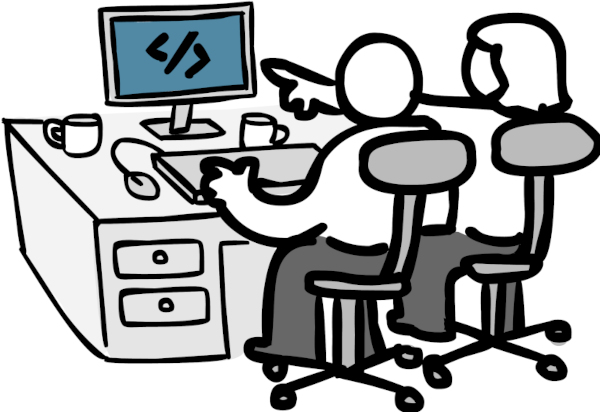
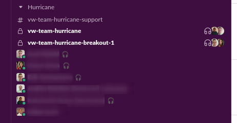
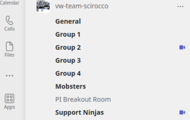

---
layout: post
title: "The Remote Team Playbook"
author: Kaj Fehlhaber
date: 2023-02-09
cover_image: 2023-02-09-the-remote-team-playbook.png
--- 

Was your Corona remote work period a lonely experience with a lot of Slack messages and PR:s to reivew? Well, it doesn't need to be that bad, but let me share some experiences with working with remote mob proramming as default.
And before you say "That seems awfully inefficient, one programming and others watching!" - keep on reading! Let me share how I have been working in my two previous teams! :bulb:

## Ingredients for a successful remote team
The main identifiers for a successful remote team in my experience has been those hat can mimic the communication bandwidth of being co-located combined with the focus of being remote. 

A high trust environment is crucial and the described approach will help in achieving it, but at the same time requires that proper attention is put in having a good environment.

_Let's go through the ingredients one by one!_
- Ensembles by default
- Find the right size
- Open sessions for every groups
- Active knowledge sharing
- Explore what works for the team
- Effective ensembles
- Automate, improve and make use of tools

## Ensembles by default :couple::couple:
The first and biggest step is for the team to switch from doing pairs ad-hoc once in a while to do it by default! Pair and ensemble programming becomes the defacto standard within the team and going solo is the exception during the main work day.

There are still lot of things that we need to do on our own and we need different amount of time for solo work in the team. This can be things like reading up on something, time reporting, etc. The important part when going to ensemble by default is to _set some ground rules_. 

In my teams we've usually started our ensembles after having a daily and having solo work before that (optionally starting up a session to invite others to join).
Lunch is at a set time with a semi-fluent length and working in the ensemble until we decide to break it up to finish of for the day or to handle some business on our own.

This has worked quite well for us since we've built up a high trust environment - often experiment and reflecting in order to change when needed. My recommendation would be to start with this kind of simple setup first and then alter if needed.

## Find the right size :technologist: :elephant: :mouse: 
Ensemble/mob programming can be efficiently implemented in teams of varying sizes, but still adhere to the same restrictions as any other team i.e. best 8 or less. I have been using this method successfully in a team of 8, but also in a growing team from 2 to 5.

The way the method scales is in the ability to break out in multiple ensembles or pairs and swarm quickly and frequently. Experiment with what sizes fit best for your team, but the sizing that has worked best in my experience is to have groups of 2-3 people and rather have 2 groups with 3, instead of 3 groups with 2 (someone is sick, someone can jump out to help others, etc).

This splitting also works very good when you own a service which you need to support. One group can handle support, look into bug reports, do improvement work and so forth, while the others focus on feature development.

When you start splitting you start to loose on knowledge sharing and you don't want to create silos. To counteract this, some mechanism needs to be in place so that there is a natural rotation between the groups. This can be triggered by a support schedule, or you simply roll the dice at the beginning of the week or what not. The rotation should be often enough to make it a natural part of work and not so often that it causes context switching.

## Open session for every ensemble 
A key element of remote ensembles and especially with multiple ensembles is to have the means to seamlessly join, switch and leave ensembles. It should be as easy as when you're sitting in the office together - just move over to the people you want to talk to.

I've been using Teams and Slack which both work great for this. In Teams, we created a team in which we created some channels. When we broke out after daily, we simply went to "Group 1" & "Group 2" channels and started ad-hoc meetings there. Teams showed a symbol at the channel that indicates that someone is in a meeting there and others can easily join. Slack works in a similar way, where we setup multiple channels and started huddles in them.

   
_Having static channels for sessions make it easy to see where to reach team mates_

The important part is that **you're always in an online meeting** and if someone needs to talk to you, it's visible and they can just jump into the meeting. This also makes life easier for product owners and scrum masters to traverse in the team or get pulled in when needed.

When working in this way where it's transparent for the entire team who is where and it's easy to jump in and out, it also allows the team to **swarm effectively**. This means that groups temporarily merge together into a big group to solve something or decide something. For example, if a group is struggling with a problem, they can jump into another group in order to get additional help. It can also be that a group feels that they want to share design ideas with the rest of the team before pursuing the work further. This builds high trust and the team can actively help each other out to deliver.

## Active knowledge sharing :teacher:
One of the key reasons why ensemble and pair programming works very well in teams is because the members learn from each other. Everyone in the ensemble gets intimate with the problems that were solved and the experience gained is shared built-in.

The downside with having a too big ensemble is that it requires a very focused team to be able to sustain over an extended time. The described format with having breakout ensembles is a way to mitigate this, as a smaller ensemble is less likely to have members zone out and instead stay focused. This does come with the issue of **less knowledge sharing**. :(

:point_up: To keep knowledge sharing at a high level when starting to break out to groups, a mechanism needs to be in place which makes it natural to share between groups. 

:gear: Some examples of mechanisms:
- Part of DoD that solution and learning of story is shared with team
- Swarm when struggling with a solution
- Swarm when the ensembles proposed direction will impact the overall service 

 _The true strength comes when the team can self-organize and split and swarm fluently_

## Explore what works for the team 
Every team is different and different persons have different needs. It's as simple as that. Because of this, it's not possible to just select a framework and start using it for everyone. The same goes with this playbook. I might call it "The Remote Team Playbook", but that's more to have a crisp title. It's probably not for everyone, but I would argue that a team which has a collaborative stance like this is much more likely to be a high performing team.

I previously pointed to some examples of how to break down a day and when to do ensembles and when not to. In reality this has been the outcome of experimenting in two different teams where this has covered most of the need **as a base**. You should always use short feedback loops! You might feel stressed in the ensemble because you feel you need to read up on something? There could be a certification that you're pursuing? The daily is a good opportunity to plan the day. Use this time slot and make it a habit for the team members to raise if they need some solo time so new ensembles can be formed.

_Don't stick to the same rules just because! Re-evaluate regularly as life and conditions change and new members might join!_

## Effective ensembles
Just putting a lot of developers in a group to start developing will not magically create a high performing team or give any specific wins by itself. This is the area where the team is in most need of guidance and maybe also specific workshops to learn the basics if no one has any previous experience of ensemble programming. 

An ensemble does not have to have a specific setup, but most commonly one person is the typist and the others navigators. Since working remote means everyone has a workstation, the typing can be quickly handed over, since the screen sharing can simply be taken over. Getting into the **routine of using a timer to rotate typist** and to take breaks is my **strong recommendation**. The risk of members zoning out or getting fatigued increases dramatically during prolonged sessions without switching.

The most important part of an ensemble is to build a **high trust environment** where all members can express their opinion and propose solutions without the risk of them being ridiculed or discarded. Pay extra attention to this and raise situations in the team. This is **crucial in any team**, but becomes obvious when working in ensembles.

## Automate, improve and make use of tools
As with any DevOps team, it's all about automating and continously improving. The same goes with the workflow during an ensemle which I will be covering here. 

### Git handovers
I highly recommend to use a tool like [`mob.sh`](https://mob.sh) to quickly push changes to a mob branch where other participants join in and take over. It's as easy as typing `mob next` and `mob start`! This way the work can be shared across multiple workstations without any complex software - just leveraging git.

Why is this important? As mentioned earlier, switching typist should be done often so it's important that this process is very quick so changes can be done seamlessly without causing context switching. But with every tool that is used in collaboration - **all members need to use it** for it to be effective, which brings us to the next part...

### Dot-files
Every team should have a shared config that can onboard new members in matter of minutes instead of using days to prepare. A so called dot-files repository can be setup, which is used to get a new environment up quickly. Important is to have a common configuration for things like `mob.sh` formatting rules for IDEs, common build tools and CLI.s.
I don't know how many times I've set this up for a team and productivity immediately increased as simple tasks and config was standardized and removed cognitive load from the team members.

### Remote equipment
Since work is done remote and the team will be in an online meetings for most of the workday, help each other out in having good audio and video. If a team member has a bad audio setup, make them aware of this. Have a small campaign in equipping everyone with a good microphone/headset - it's a simple way of removing obstacles.

Video is also important, but the quality is not as important. Facial expressions, gestures and others are important parts during discussions - but video is also important just to show that you're actually there. Maybe there was an urgent call, children came crashing in during work or whatever reason? With video you can see what happened (or lack of video could indicate something happened).

## Recognition
I have by no means invented all this myself, but rather documented the experience gathered from multiple teams where we together have refined the format and guides.

## Final thoughts
There is of course a lot into a great team. Without great people, there will not be a great team. But what "great" means does need to be the same thing. People are puzzle pieces that together can achieve greatness.

I hope this helps whoever reads this in trying out something new and daring to go outside of the norm and instead have a progressive approach to development!
