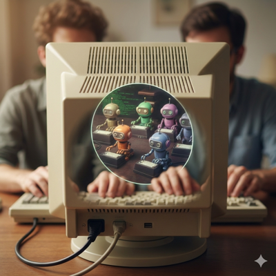

Why don't we see a higher adoption of vibe coding in the industry today? The technology and the know-how of how to
leverage it is already here. [“Technology is only 20 percent of the challenge; the other 80 percent is
cultural."](https://online.hbs.edu/blog/post/build-team-confidence-with-ai) says it quite well. You don't only need to
take the step to really practice it yourself - you need to get buy-in from the rest of the team as well.

## The new mob
I have been a great proponent of remote mob programming for quite a while now, creating collaborative cultures in
multiple new teams; using git handovers and having timers to discuss how we solve different problems, keeping focus on
one thing. This has been vital for getting a team up an running, especially with a diverse team of different experience
levels. Not only for the knowledge spread, but also building culture.

However, times change - I now find myself having these sessions with AI agents.

What was previously a session where the goal might be to create a functionality and that everyone getting familiar with the
details of the solution has now moving more and more towards handling higher level goals and to keep agents going in a
common direction.

*I no longer conduct mob sessions with the goal of refactoring code by hand.*

This is nothing that I have done by any specific stance or rule, but it rather has just naturally become this way. I
feel that it's hard to be able to manage multiple agents at the same time that I discuss with team mates. It's just too
much discussions going in at the same time for me to feel like I can focus.

## The new details
I start to care less and less if the code generated is exactly according to what my style of code is. What is important
is that the code does what it should. Refactoring is done at such speed by AI that it's no longer a large endeavour to
do so.

The hard part is to move from the habit of reviewing every line of code with the ambition of keeping the AI produced
code in the exact same style as that of what a human would write in the team. This is a greater challenge than it may
sound like. How do you as team go from a "regular team" to an "AI enabled team"? Does mob and pair programming still
have a place?

## The difference in the team
> ["We're living in parallel realities"](https://mitsuhiko.github.io/talks/me-and-the-machine/#13)

Maybe you've seen this unfold at your workplace? Some have taken the plunge to embrace vibe coding (I still think that
the name has not been very helpful) and some stick to at most code-completion and perhaps chat assisted coding. *

If you mix both in one code base, you get *none of the benefits*:
- Code reviews get awful because AI can refactor at high speed which make the code reviews a major bottleneck. The code
  should have the same pattern as that of your colleagues.
- If you instead only introduce AI in a modest amount, you're missing out on the speed of agents and still keep all
  the cognitive load.

## Begin small
My take is that any team would benefit from at least choosing one repository which is **purely** updated by agents - no
human touches the code. *Why?*

- The team learns how to vibe code and how to do it in a controlled way. This is still a young discipline. Getting the
  team to be proficient is the key to take the step.
- There is an entire code base which the team does not need to know exactly how it is implemented. Since AI can refactor
  at such speed, it's possible to do so. Code reviews are sped up dramatically since the focus is on a higher level.
- The team is able to iterate on guard rails in CI and tests, enabling agents to verify their own work and keep on track.

But what about the way of working in the team?

## Swarming
What I think has become even more important is to *swarm* between team members to discuss architecture and the direction.

I mostly work with infrastructure and platform related problems. This means that there is not just one big code base, but
rather many smaller pieces that combined becomes the platform. CLI for users to interact with platform backed services,
Helm charts for users and of course deployment of Kubernetes clusters with select operators, security tooling and
networking.

Keeping focus on the joint target becomes more important. This still leads to valuable discussions, but we don't need to
discuss variable naming or if we should use a specific pattern in the implementation. Instead we should focus on the
requirements of the system we're building.

## Learning from each other
There is one element that will still be a cornerstone when mob and pair programming - **learning from each other.**

This is applicable for all type of skills. Vibe coding just as much as any other programming. I'm looking forward to
have several sessions with my team; learning, teaching, sharing!

Pairing sessions can have the exact same function as before, just on another level!

## Taking the step
Just talk about it and make small steps. AI used by a novice will not give you very impressive results right away. It
*can*, but likely not in a live service with a vague prompt and no feedback loop. This has been the experience for many,
so the trust is not too high that it will succeed.

What I think is crucial is for the entire team to understand that this is a new paradigm. You will get **very**
productive, but only if you're able to get proficient in working with it.

*You won't get proficient without practicing. So pick something real to work on to hone your skills together!*
