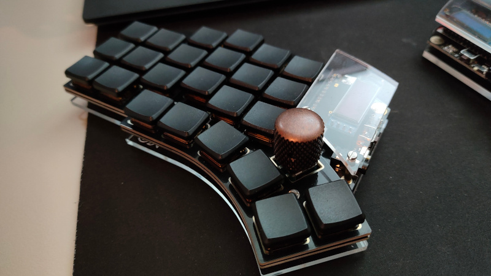
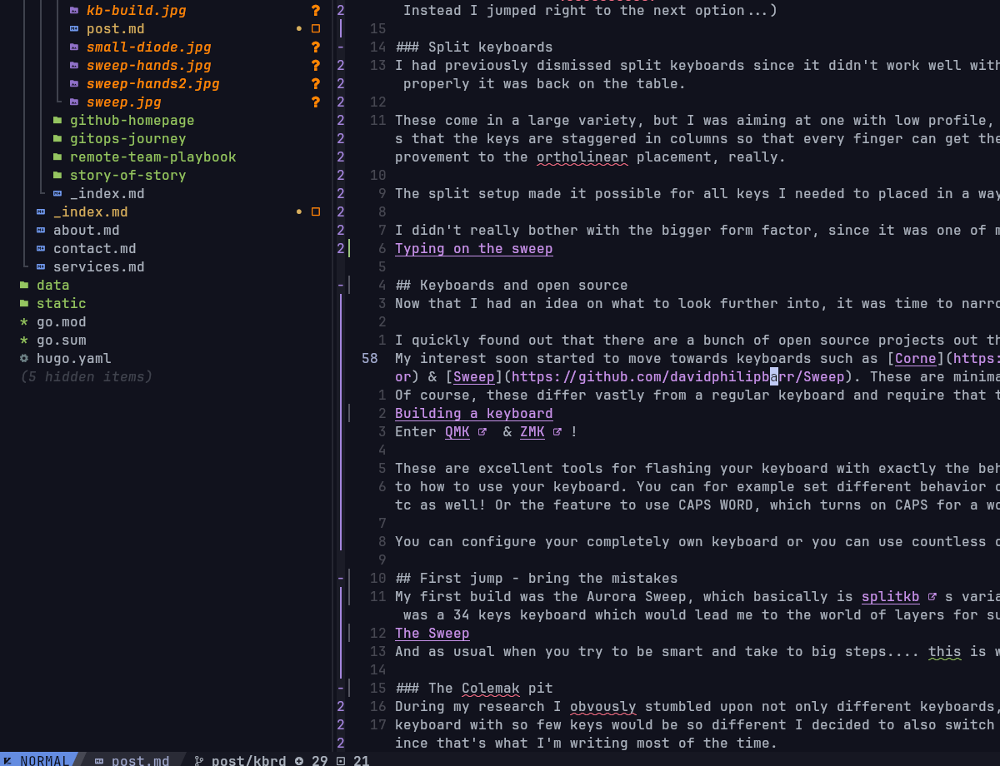
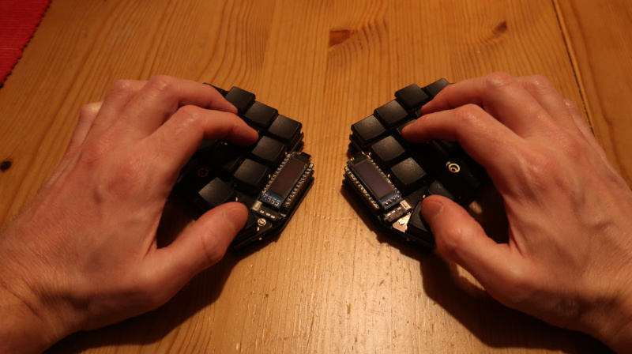
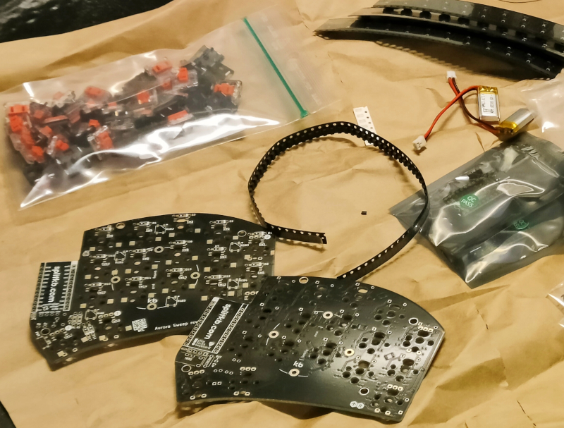
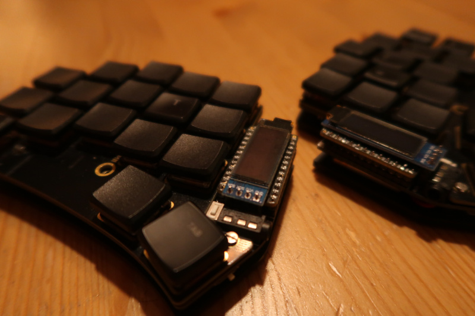
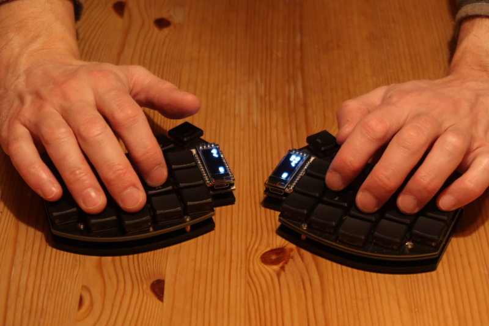
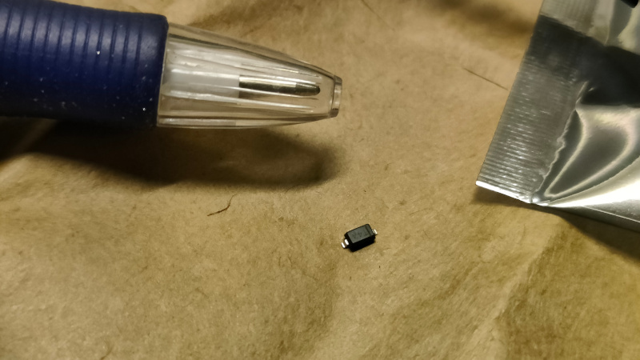

I have never understood the custom keyboard community... Why would you spend so much time and effort to have a special keyboard?
Wouldn't it just make it harder when getting to a regular keyboard and make yourself tied up?

**...Only to now find myself in this maze of split keyboards with custom bindings and what not!**

Let me share why I did this 180 and how I took the plunge and also (started to) get productive with my first custom keyboard.
This is somewhat of a different blog from what I have usually done, but thought it could be a good help for anyone getting started.

## Starting my journey
After summer I started exploring the notion of ditching the Swedish layout since a lot of the symbols that are used in programming were placed on awkward locations.
It would make more sense to use the US layout instead for this reason. So begins my journey...
Obviously, using a US layout means I need to handle åäö when typing Swedish somehow.

**Introducing xkb and creating custom layouts!**

At this point I had started my journey towards **Vim** (or rather **Neovim**). While I felt that the concept of ditching the mouse in
favor of moving around with powerful motions, there was a feeling that I had trouble touch-typing characters that were farther from homerow.
Didn't think too much about it, but did get a cheap 60% keyboard from Amazon to be able to focus more on the keys near homerow.
This worked quite nice, but noticed that the layout change was a lot better than what the keyboard was (it actually kind of sucked).

I guess it was at this point that I started actually looking into custom keyboards...

*Writing the blog in Neovim*

## What options are out there?
I have quite small hands and a reason for even looking at custom keyboards was that I saw a much higher likelihood of being successful
at touch-typing with a smaller form factor keyboard.

There are sooo many variants out there, but that's kind of implied since they are **custom** keyboards. I identified some interesting groups to look more into:

### 60% form factor
The first path I went, which I still believe is a good first step with out too much training need. You get rid of fn, nav & num cluster and have the main keys left. For someone who uses vim motions where you don't really use the arrow keys all that much, this works great!

### Ortholinear
The way fingers need to move on a regular keyboard is quite straining, since keys are placed diagonally. If you try to touch-type, you will notice this quite soon. Ortholinear keyboards place keys in a grid which makes reaching them more natural. (Or it' said to be. I never tried it out. Instead I jumped right to the next option...)

### Split keyboards
I had previously dismissed split keyboards since it didn't work well with how I type(d), but since part of the journey was to learn touch-typing properly it was back on the table.

These come in a large variety, but I was aiming at one with low profile, small form factor and an aggressive column-stagger. Column-stagger means that the keys are staggered in columns so that every finger can get their keys at a distance better suited for the length of the finger. An improvement to the ortholinear placement, really.

The split setup made it possible for all keys I needed to placed in a way which made them easy to reach, so this was the obvious path for me.

I didn't really bother with the bigger form factor, since it was one of my drivers to be able to use a keyboard with few keys.

*Very neat form-factor!*

## Keyboards and open source
Now that I had an idea on what to look further into, it was time to narrow down the options.

I quickly found out that there are a bunch of open source projects out there with designs - just like with any other software!
My interest soon started to move towards keyboards such as [Corne](https://github.com/foostan/crkbd), [Piantor](https://github.com/beekeeb/piantor) & [Sweep](https://github.com/davidphilipbarr/Sweep). These are minimal keyboards which works with layers rather than many buttons.
Of course, these differ vastly from a regular keyboard and require that the keys are mapped out to what suits my need!

*Building the Sweep*

Enter [**QMK**](https://docs.qmk.fm/#/) & [**ZMK**](https://zmk.dev/)!

These are excellent tools for flashing your keyboard with exactly the behavior you want and open up a completely new world when it comes
to how to use your keyboard. You can for example set different behavior on tap vs hold - this enables you to use your homerow for shift, ctrl, etc as well! Or the feature to use CAPS WORD, which turns on CAPS for a word, then turns it off!

You can configure your completely own keyboard or you can use countless of configurations which the community has shared.

## First jump - bring the mistakes
My first build was the Aurora Sweep, which basically is [splitkb](http://www.splitkb.com)s variant of the Sweep. I really didn't start soft... It was a 34 keys keyboard which would lead me to the world of layers for sure!

And as usual when you try to be smart and take to big steps.... This is where you make mistakes!

### The Colemak pit
During my research I obviously stumbled upon not only different keyboards, but also different layouts. Since the experience of using a split
keyboard with so few keys would be so different I decided to also switch layout to something which was more optimized for the english language since that's what I'm writing most of the time.

I decided to go ahead with `colemak`.

The process to get started was quite slow at first, but got up to speed after a while. Training using [keybr](http://keybr.com) paid off - this is a great tool to by learning touch typing by adding one key at a time to the training!

When I felt I was proficient enough to at least try out a little bit at work, I quickly realized something - **remapping a whole lot of vim bindings and learning those!** I considered it for a while, but after struggling quite a lot I came to the realization (which you likely have already been thinking of...):

I will need to **go back to qwerty** again.

I guess if I had been writing English text exclusively instead of writing code it might have been different. But the fact is that most typing includes symbols and a lot of navigating through files.

**Vim bindings are universal** so I would basically render all nice navigation in tools like `k9s`, `lf` & `lazygit` useless. Adding custom mappings would just make things complicated.

### Layers, layers, layers
Using a keyboard with few keys made it easier for me to keep my fingers at the right place and get me better at touch-typing. Coming from someone who has never really learnt touch-typing and usually just sits wrong with the fingers and mistyping everything when the hands wander off.

This does of course come at a cost: the use of layers increases.

**What is a layer?** You might ask...

Basically, you use a layer when you press a button like 'Alt' or 'Ctrl'. On smaller keyboards there are simply additional ways to access other layers where you put keys like symbols, fn and numbers. On a really small keyboard like the **Sweep**, I use the thumb buttons as layer-switches.
I hold the button down and the layer is switched, but I just tap it and it's a button like `tab`. This would allow me to make use of the keys in a very good way.

Again, `ZMK` is awesome with adding a lot of configuration possibilities that enable all of this.

However, this is sometimes great and sometimes not.

For me when using the sweep, this meant that I needed to use the layer switching for thumb buttons like 'space' and 'backspace'. That's still alright for some applications. However, when using 'space' as leader in `neovim` this is naturally pressed like a modifier key even though you don't have to.
This becomes a real mess in your head when holding the button down suddenly makes the intended buttons do something completely different.
Aldo, Miro and Excalidraw uses `space` to activate pane, which of course is not possible when holding down `space` triggers the layer instead.

I really wanted *some* additional key...

## New try - Kyria
The thumb cluster with only two buttons was a little bit to small for me (at least as main driver. The form factor is awesome!).
While I really enjoyed the Sweep I likely will always use my mouse for certain tasks like creating visuals and such. The Sweep setup was nice when you always use both hands... but let's keep it real. You will likely want to do, for example, copying with your left hand while you use the mouse with the right.

*The Kyria as I built it, using encoders*

This lead me to the [Kyria](https://splitkb.com/products/kyria-rev3-pcb-kit), which looked like it would do the trick for me!
Likely, the Corne with one additional thumb key would have been enough, but it was a good deal and I could play around with using an encoder to see if it was useful.

### Soldering SMALL things!
At this stage I was quite proficient at soldering even those small smb diodes to the pcb, so building the next keyboard was quite quick indeed!
I could reuse basically all the components (even though I wanted to have other switches for the new build).

*The diodes and resistors are crazy small!*

For the first build, however, the experience was quite intimidating! I had ordered hot swap sockets for low profile switches, which meant that I would get smb diodes (which is basically a tiny variant of diodes which don't have legs but are soldered straight to the pcb).
If you go this route, make sure you have steady hands and/or patience!

## Wrapping it up...
It has now been a journey of a couple of months since I seriously started with custom keyboards. I can't really tell yet if the work has been worth it, but I *do* know that I could have easily shaved off quite some time if I would have made better choices earlier! What I also know is that I can sit here quite relaxed in the sofa, having my wireless split keyboards very comfortably at either side of me and can type and navigate while I can keep looking at the screen - something I would not been able to do previously.

I'm still quicker on my regular keyboard, though I cannot type without looking down every so often when my hands wander off due to the distance of the keys. It will be an interesting period ahead where I'm now at least proficient enough to use the keyboard at work (though I might test my team mates patience from time to time). Accuracy is key!

### Some learnings!
- Think about your use case! Real hard! (I thought I had)
- Only switch layout if you have understood the consequences!
- Use tools like [keybr.com](https://keybr.com), [monkeytype.com](https://monkeytype.com) and others to train on touch-typing.
- Make sure you are using ZMK or QMK so you can customize your layout.
- [Keymap editor](https://nickcoutsos.github.io/keymap-editor/) is a great tool for configuring your keyboard! Keep fixing your keyboard for your need.
- Train every day to get up to speed
- Don't only train on the above tools! Navigate on your computer (i3, neovim, etc). It's a different experience than only writing sentences.

### Conclusions
I'm quite positive I will able to move around and type much faster now that I put some effort into it. But is this for everyone?

As usual, it's a big "depends". If you want things to "just work", then likely not. If you want to be able to configure everything so it fits your need, then highly likely!
