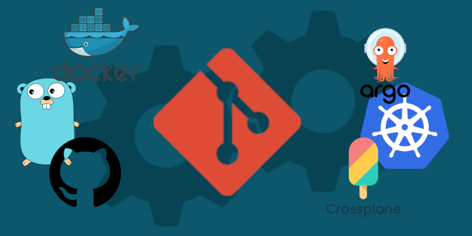

In the past couple of months, I've been part a journey which led us to incrementally automate more and more of a service deployed in Kubernetes.
During this period it became clear that there is a lot of talk about GitOps, but not very many hands-on, concrete, blogs and examples on the matter.

This is my attempt at contributing this area.

This will be the first part of a series of blog posts which I will be publishing where I will be building examples of real world CI/CD tooling.
The posts will follow the process of iteratively adding functionality to the pipeline. Starting with this post with not even a CI/CD, but only
building the most basic building blocks in order to be successful.

**Want to get to the code right away?** Check out the accompanied [Github repository](https://github.com/fehlhabers/gitops-example)! 👈

## 🤔 GitOps - what is it?
In short GitOps basically means that everything that you see in the trunk (main branch) of a repository is also what is deployed.
It's much like how Kubernetes works; you specify a *desired state* and the system tries to reach this state by deploying or tearing down resources.

There are some different definitions regarding GitOps, but it usually boils down to:

📝 Infrastructure-as-Code

🔍 Pull Requests to deploy changes

🚀 Highly evolved CI/CD

And it makes perfect sense, since you want these parts to work in tandem in order to give the result you want: To deploy your service by simply
merging a pull request, automatically having it scanned for vulnerabilities and having an audit trail out-of-the box.

Unfortunately, there is no one-size fits all solution out there, so setting up a repository or multiple repositories to enable GitOps is not trivial.
Different technologies need different approaches, where CI/CD pipelines are built in a way to make a repository act as a GitOps repository.
Let's dive into an example with some concrete technologies and the challenges and solutions to them!


I will touch more into the topic, but embracing GitOps implicitly means that you also embrace **Trunk Based Development (TBD)**.


## 🎯 Goal of the journey
The journey of this blog post series will take us through a couple of concepts and technologies. I will be using some popular tools and technologies when it comes to cloud computing,
but these are by no means the only or best way for you. They are a mix of technologies I want to explore and technologies I'm familiar with.

The setup consists of:

- *Containers* for applications
- *Github Actions* as the CI/CD base which glues all together
- *CodeQL* & *Github Advanced Security* for vulnerability scanning
- *Helm* charts to package *Kubernetes* resources
- *ArgoCD* for deploying our Helm charts
- Either *Crossplane* or *Terraform/OpenTofu* for cloud-specific resources
- All of this in a way which supports *multiple stages* and zero-downtime

This can become a quite daunting task in a complex environment, so we'll split it up in this series in order to focus on *one thing at a time*.
The focus area of the first part is therefore to just be able to create the *base flow for building containers!*

## 🚀 Let's start! 
The first objective of this journey will be to be able to have an infrastructure which supports building applications and deploying these
to different stages. This is the backbone of any GitOps setup.
What I'm talking about is of course to package your applications in a way which makes it possible to easily deploy the version of our choice
and to be able to quickly do so.

This can be done in a bunch of different ways. Maybe you use serverless functions like AWS Lambdas or VMs, but since I'm creating this with
Kubernetes in mind I will show best practices using **containers**.

### 📁 Repository structure
There is no special structure needed in a repository, but since I have chosen to go with a mono repository, it's important to put all
applications in directory for applications and that all applications are built in the same way. This makes the pipeline scaleable and avoids headache when adding
more apps. Check out [my repository](https://github.com/fehlhabers/gitops-example) for an example.

An alternative is to separate infrastructure code and application code in separate repositories, since these make use of different pipelines and the application has
a CI element to it, which delivers artifacts which will result in configuration changes in the Infrastructure-as-Code. Since the pipeline action can be easily separated
depending on directories, I chose a mono repository. Both of them work and have their pros and cons.

The applications do not need to be built with the same language, but it makes things easier when it comes to package management and such. As long
as the applications are containerized, we're all good!

### 📦 The container
I've chosen to create a very simple Golang application to be the example at hand. See the [example repo](https://github.com/fehlhabers/gitops-example/tree/main/apps/cruncher) for full info.
The reason I did this is to demonstrate how a container can be done very small and secure. A strength of compiled languages like Golang is that the app can be built into a single binary which can be added to `scratch`, eliminating pulling in any potential vulnerabilities in a runtime. In this case, the container weighs in at only **9MB**.

However, all languages can be containerized. It's just a matter of how much of a runtime is needed for the language. For example Java, you need a container with a JRE, for Python an interpreter, NodeJS, etc. You just pull in more dependencies which you need to scan and handle.

**Aspects to consider when configuring a container:**

- ⛰️ Use multi-stage images in order to standardize the build step and to harden the deployed image
- 🐜 Make the deployed container as small as possible
- ✍️ Avoid writing to the file system if possible
- 🔐 Always run the container as a non-root user

*Here is an example of how a Dockerfile using the builder pattern could look:*
```Dockerfile
FROM golang:1.21-alpine AS builder

WORKDIR /src
COPY go.mod go.sum ./
RUN go mod download          # Downloads in separate layer for caching

COPY . ./
RUN go build -o /bin/app .   # Build binary in builder
RUN useradd -u 10001 appuser # Create non-root user

##########################################################################
# This is the image we deploy. It *only* contains the binary and user-info

FROM scratch

COPY --from=builder /bin/app app
COPY --from=builder /etc/passwd /etc/passwd
USER appuser
EXPOSE 8080
CMD ["./app"]
```
*The builder has the needed parts to build the binary and copies the app & the user info in order to run as non-root*

#### 🐭 Does size matter?
As you've noticed, I've written quite some about the container size, so thought I'd give this an extra paragraph.

There are really two aspects to it:
- Things that are large become slow
- Large = lot of code = more complex = more likely to be vulnerable

When you develop a service, you want **fast** feedback and **fast** deployments and **fast** services. Think about the build pipe - Code scanning a large application, uploading
a large image, etc. It's the same when Kubernetes wants to spin up some replicas of your container on a node. The container first needs to be downloaded. How quick do you think
that is when your container is 200MB?

## 👋 That's all - see you in the next!
We now have the basics needed to run our application in a container in a secure way!
Next time let's build a pipeline which can handle many of these applications!

The next part of the blog will contain:

- Setup of Github repository with sane configuration
- CI using Github Actions for scanning, tagging & publishing containers
<br>
<br>

**/Kaj Fehlhaber** <br>
