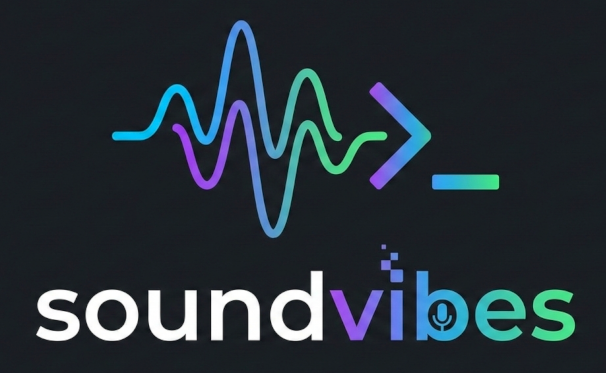

I never intended to build a speech-to-text application. I had zero experience with Rust. Yet here I am, with [SoundVibes](https://soundvibes.teashaped.dev) - a working voice dictation tool for Linux that I built in a weekend in Rust. This is the story of how I got there, and what it taught me about this new way of building software.

## The Frustration That Started It

I've been experimenting with vibe coding for a while now, and one thing became clear: speaking your ideas is a lot faster than typing them. Developers think at speaking speed but type at a fraction of that. Voice dictation makes sense when you're trying to keep up with the flow of ideas.

The problem is Linux speech-to-text tools are... complicated. I tried several options and kept hitting walls.
They either didn't work at all, didn't support Wayland, had broken global hotkeys, or required the use of cloud services.

I just wanted to press a key, speak, and have text appear where my cursor was. No cloud, no dependencies, no complex setup.

## The Weekend Project

So I decided to build it myself. The catch? I'd never written Rust before. I knew nothing about audio capture on Linux, nothing about integrating with Whisper, nothing about X11 or Wayland internals.

But I'd been recently practicing vibe coding "for real". I knew how to work with AI agents, how to set up guard rails, how to iterate quickly. Steve Yegge and Gene Kim's book on vibe coding had been on my mind, particularly the idea that projects once deemed too difficult become feasible when you have AI assistance. This seemed like the perfect test.

The traditional approach would be weeks of learning Rust fundamentals, then weeks studying audio APIs, then weeks on Whisper integration. I never have the time to do these kind of projects on my spare time. Time that I rather spend with my family, leaving projects like these in the freezer.

## Building Differently

Here's the thing about vibe coding: vibe coding isn't about knowing less. It's about applying your expertise differently. I couldn't write Rust fluently, but I knew how to design interfaces, how to structure tests, how to validate that something actually worked.

The key was closing the feedback loop. I set up high-level behavioral tests early - not unit tests checking individual functions, but integration tests that verified the whole flow from audio capture to text appearing on screen. These became my safety net. The agent could refactor, reorganize, extend the code, and immediately know if something broke.

I also established CI/CD from day one through GitHub Actions. Every change got built and tested automatically - patterns
that are no different than regular software development. But also being able to run the same tests locally with a hook
always makes the agent get the needed feedback.

## Iterative Refactoring

Each time I added new behavior - first audio capture, then transcription, then the actual text injection - I'd have the agent refactor the codebase. This kept any sessions to the point and avoided broken functionality.

With an agent, refactoring took minutes instead of hours. There was no reason to let technical debt accumulate. The architecture improved continuously.

The Rust compiler helped here too. Its strict type system caught errors that would have been runtime surprises in Python or JavaScript. When the agent generated code that didn't compile, those error messages became part of the feedback loop. Fix, recompile, iterate.

## What I Actually Built

SoundVibes ended up as a single static binary. No Python dependencies, no virtual environments, no package conflicts. Download it, run it, done. It handles Whisper model downloads automatically on first run and using GPU with Vulkan.

The architecture solved a problem that had frustrated me with other tools: hotkeys. Instead of fighting with X11 or Wayland's inconsistent global hotkey APIs, I split the application into a daemon that listens on a Unix socket and a lightweight client. This means you can trigger SoundVibes with whatever hotkey system you already use - xbindkeys, sxhkd, your window manager's shortcuts, even a Stream Deck. The hotkey binding is decoupled from the application itself.

It works on both Wayland and X11, typing text wherever your cursor happens to be. Terminal, browser, IDE, chat application - doesn't matter. The text appears at the cursor. Everything runs locally.

The amazing part: I created a tool that I would have never started working on otherwise. And I don't have any worry that
I won't be able to maintain it.

## The Realization

SoundVibes works. I use it daily now for code comments, documentation, commit messages, even drafting blog posts like this one. But the tool itself isn't the important part.

What's important is understanding how the barrier to building software has shifted. You don't need to be an expert in every technology anymore. You need to be an expert in defining what you want, setting up ways to validate it, and knowing when the output is correct. The implementation details can be handled collaboratively with AI.

This isn't abdicating engineering responsibility. It's shifting where you apply judgment. Architecture matters. Testing matters. Knowing whether something actually solves the problem matters. Variable naming and syntax? Much less so when an agent can refactor in seconds.

The mindset isn't about recklessness. It's about calculated risk-taking enabled by AI assistance. Projects that once sat in the "maybe someday when I have time to learn the tech" bucket suddenly become weekend projects.

If you're wondering whether you're "ready" to build something ambitious with AI assistance, the answer is you're never fully ready. That's kind of the point.
